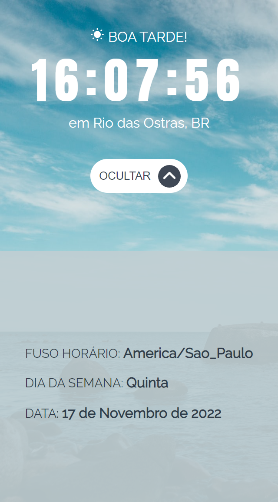

# Projeto App Clock

É um aplicativo de relógio e foi inspirado no Clock app do Frontend Mentor porém possui modificações. Apresenta a hora atual e informações de localização com base no endereço IP, para isto faz uso da IP-API (https://ip-api.com/docs). 

No estado expandido exibe informações adicionais como: fuso horário, data completa e dia da semana. 
Altera a saudação inicial, background e as cores de acordo com o horário do dia ou noite. 

<strong>O objetivo do projeto é praticar os seguintes conceitos:</strong> 

- Utilizar os hooks useState e useEffect
- Usar o CSS modules e Sass
- React icons
- Absolute imports

## 💻 Layout  

### Web

  
  

### Mobile

  
  

 ## 🔧 Tecnologias 

As tecnologias usadas foram: 
* React
* JavaScript
* Sass

## 🛠️ Abrir e rodar o projeto
Para abrir e rodar o projeto, execute npm i para instalar as dependências e npm start para inicar o projeto.

Depois, acesse http://localhost:3000/ no seu navegador.
